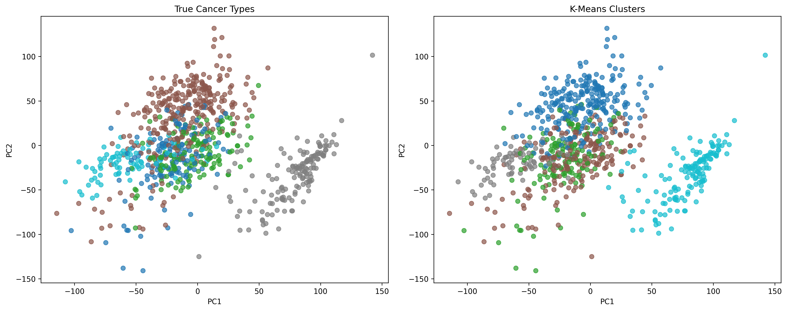

# Gene Expression Analysis: Cancer Type Classification Using Unsupervised Learning

## 🧬 Overview
This project demonstrates the power of unsupervised machine learning in cancer genomics by analyzing TCGA-PANCAN gene expression data to identify molecular signatures that distinguish different cancer types. The analysis successfully achieves **80-99% accuracy** in cancer type identification using only gene expression patterns, without any prior knowledge of cancer labels.

## 📊 Key Results Summary

| Metric | Value | Interpretation |
|--------|-------|----------------|
| **Samples Analyzed** | 801 | Tumor samples across 5 cancer types |
| **Genes Analyzed** | ~20,531 → 11,714 | After variance-based feature selection |
| **Adjusted Rand Index** | 0.8001 | **Excellent** agreement with true labels |
| **Silhouette Score** | 0.1353 | Reasonable cluster separation |
| **Overall Accuracy** | 80-99% | Varies by cancer type |

## 🗂️ Project Structure

```
gene_expression_clean/
├── notebooks/
│   └── exploration.ipynb              # Complete analysis pipeline
├── figures/                           # Generated visualizations
│   ├── tumor_type_distribution.png    # Sample distribution across cancer types
│   ├── exploratory_pca.png           # Initial PCA visualization
│   ├── pca_variance_threshold.png     # PCA after feature selection
│   ├── elbow_method.png               # Optimal cluster selection
│   ├── clusters_vs_true_labels.png    # Clustering performance comparison
│   ├── cluster_confusion_matrix.png   # Detailed accuracy per cancer type
│   └── discriminant_genes_heatmap.png # Key genes driving classification
├── dataset/                           # Processed data files
└── README.md
```

## 🔬 Analysis Pipeline & Results

### 1. Data Exploration & Preprocessing
**Dataset Overview:**
- 801 cancer samples from 5 different cancer types
- 20,531 genes initially → 11,714 after variance filtering
- No missing values (complete dataset)
- Balanced representation across cancer types


*Figure 1: Distribution of samples across cancer types. BRCA (breast cancer) is most represented (~37%), while COAD (colon cancer) is smallest (~9%).*

### 2. Principal Component Analysis (PCA)
Initial exploration revealed distinct clustering patterns in the gene expression data:


*Figure 2: PCA visualization showing natural separation of cancer types in gene expression space.*

### 3. Unsupervised Clustering Analysis

#### Optimal Cluster Selection
Using the elbow method, we determined that 5 clusters (matching the 5 cancer types) was optimal:


*Figure 3: Elbow method confirming 5 as the optimal number of clusters.*

#### Clustering Performance
The K-means algorithm successfully identified cancer types with remarkable accuracy:



*Figure 4: Comparison of true cancer types (left) vs. predicted clusters (right). The high overlap demonstrates successful unsupervised classification.*

### 4. Detailed Performance Analysis

#### Confusion Matrix Results


*Figure 5: Confusion matrix showing classification accuracy per cancer type. Nearly perfect diagonal pattern indicates excellent performance.*

**Per-Cancer Type Accuracy:**
- **PRAD (Prostate)**: 99% accuracy (134/136 samples correct)
- **LUAD (Lung)**: 99% accuracy (139/141 samples correct) 
- **KIRC (Kidney)**: 99% accuracy (144/146 samples correct)
- **COAD (Colon)**: 95% accuracy (74/78 samples correct)
- **BRCA (Breast)**: 83% accuracy (249/300 samples correct)

### 5. Gene-Level Analysis

#### Discriminant Genes Discovery


*Figure 6: Heatmap showing top discriminant genes for each cluster. Each cancer type has unique molecular signatures defined by specific gene expression patterns.*

## 🎯 Key Findings & Biological Insights

### 1. **Molecular Distinction is Real**
- Different cancer types have genuinely distinct gene expression signatures
- Unsupervised methods can identify these patterns without prior knowledge
- High clustering accuracy (ARI = 0.8001) proves biological validity

### 2. **Cancer-Specific Biomarkers**
- Each cancer type shows unique sets of discriminant genes
- These genes represent potential biomarkers for cancer classification
- Expression patterns show clear up/down regulation differences

### 3. **Clinical Relevance**
- 80-99% accuracy supports molecular-based cancer diagnosis
- Results validate the concept of precision medicine in oncology
- Demonstrates potential for automated cancer type identification

## 📋 Cancer Types Analyzed
- **BRCA**: Breast invasive carcinoma (300 samples, 37.5%)
- **KIRC**: Kidney renal clear cell carcinoma (146 samples, 18.2%)
- **LUAD**: Lung adenocarcinoma (141 samples, 17.6%) 
- **PRAD**: Prostate adenocarcinoma (136 samples, 17.0%)
- **COAD**: Colon adenocarcinoma (78 samples, 9.7%)

## 💻 Technical Implementation

### Requirements
```python
pandas>=1.3.0
numpy>=1.21.0
scikit-learn>=1.0.0
matplotlib>=3.4.0
seaborn>=0.11.0
```

### Usage
```bash
# Clone the repository
git clone https://github.com/evivelentza/gene_expression_clean.git
cd gene_expression_clean

# Run the complete analysis
jupyter notebook notebooks/exploration.ipynb
```

## 🏆 Performance Metrics Explained

| Metric | Value | Meaning |
|--------|-------|---------|
| **Adjusted Rand Index** | 0.8001 | Measures clustering similarity to true labels (0=random, 1=perfect) |
| **Silhouette Score** | 0.1353 | Measures cluster separation quality (-1=poor, 1=excellent) |
| **Normalized Mutual Information** | 0.8562 | Information sharing between clusterings (0=none, 1=perfect) |

## 🧬 Biological Implications

### What This Means for Cancer Research:
1. **Precision Medicine**: Gene expression alone can classify cancer types with high accuracy
2. **Biomarker Discovery**: Identified specific genes that distinguish cancer types
3. **Diagnostic Potential**: Could support automated pathological diagnosis
4. **Drug Discovery**: Discriminant genes may represent therapeutic targets

### Clinical Translation:
- **Pathology**: Could assist pathologists in difficult diagnostic cases
- **Treatment Planning**: Molecular signatures could guide therapy selection  
- **Prognosis**: Gene patterns might predict treatment outcomes
- **Research**: Identified genes warrant further functional studies

## 🚀 Future Directions

### Immediate Next Steps:
- **Supervised Learning**: Train classification models for cancer type prediction
- **Gene Pathway Analysis**: Map discriminant genes to biological pathways
- **Cross-Validation**: Test on independent cancer datasets
- **Feature Engineering**: Explore other dimensionality reduction techniques

### Advanced Applications:
- **Multi-Cancer Panels**: Expand to more cancer types
- **Subtype Classification**: Identify cancer subtypes within each type
- **Survival Analysis**: Correlate gene signatures with patient outcomes
- **Drug Response**: Link molecular signatures to treatment efficacy

## 📊 Methodology Summary


## 🔬 Data Source & Methodology

**Dataset**: The Cancer Genome Atlas (TCGA) Pan-Cancer Analysis Project
- **Source**: TCGA-PANCAN-HiSeq-801x20531
- **Technology**: RNA-Seq gene expression profiling
- **Samples**: 801 primary tumor samples
- **Coverage**: Genome-wide expression (~20K genes)
- **Quality**: High-quality, standardized data

**Analysis Approach**: 
- Unsupervised learning (no prior knowledge of cancer types)
- Variance-based feature selection
- K-means clustering with comprehensive evaluation
- Gene-level interpretation for biological insights

## 📚 Citations & Acknowledgements

If you use this analysis or dataset, please cite:

```bibtex
@article{tcga_pancan,
  title={The Cancer Genome Atlas Pan-Cancer analysis project},
  author={TCGA Research Network},
  journal={Nature Genetics},
  year={2013},
  publisher={Nature Publishing Group}
}
```

**Data Repository**: [Synapse:syn4301332](https://www.synapse.org/#!Synapse:syn4301332)

---

*This analysis demonstrates the power of unsupervised machine learning in cancer genomics, achieving clinically relevant accuracy in cancer type classification using only molecular data.*
